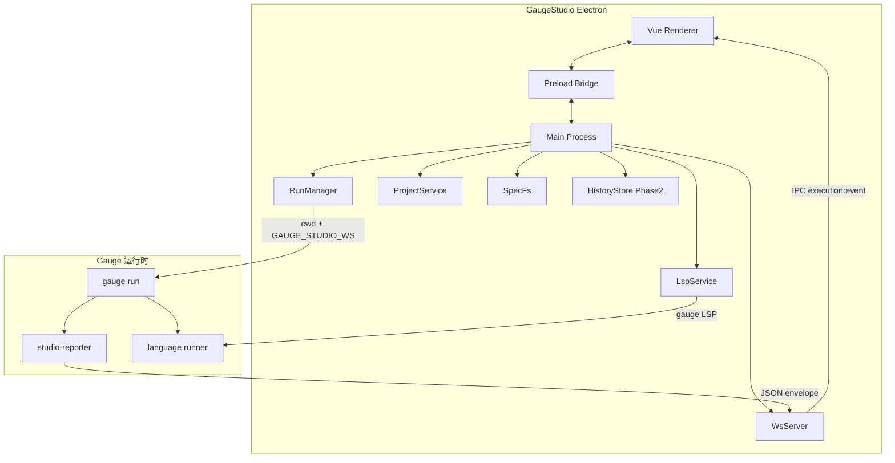
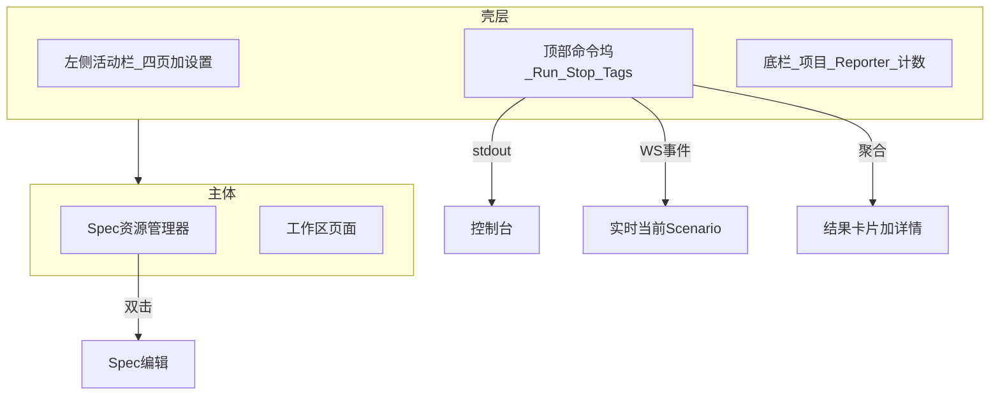
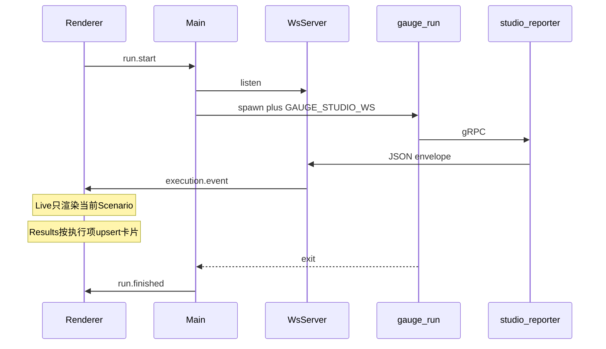

# GaugeStudio 设计基线

本文档是仓库内 **行为与架构的唯一设计基线**。  
视觉与交互布局对照见 [`ui-mock/index.html`](ui-mock/index.html)；**行为以本文为准**（mock 中的 `forcePass` 等演示逻辑不得带入正式实现）。

协议事实来源：[`studio-reporter/API.md`](../studio-reporter/API.md)（Gauge → Studio **单向** WebSocket 推送）。

技术栈（固定）：**Vue 3 + Element Plus + Pinia + Vue Router + Electron + JavaScript**，脚手架 **electron-vite**。

---

## 1. 系统架构



### 进程职责

| 进程 | 职责 |
|------|------|
| **Main** | 起停 WebSocket、spawn/kill Gauge、读项目文件、Spec 读写、LSP、运行历史（Phase 2） |
| **Preload** | 白名单 IPC；禁止渲染进程直接使用 `child_process` / `fs` |
| **Renderer** | 纯 UI + Pinia；订阅执行事件，发起运行 / 重试 / 编辑命令 |

---

## 2. 信息架构（冻结）



| 区域 | 规则 |
|------|------|
| 左树 | 仅含 `.spec` 的目录；`specs` 默认展开；勾选 = 本次运行目标；双击打开编辑 |
| 控制台 | **仅** Gauge 进程 stdout/stderr（与 WS 事件严格分离） |
| 实时 | **仅**当前正在执行的 Scenario（含 Concept 嵌套）；历史交给结果页 |
| 结果 | 执行项卡片 + 右侧详情；Concept 递归步骤；数据驱动表格与行切换 |
| 编辑 | 整页 Spec 编辑，写回项目文件；Gauge LSP 提供 CPT Concept 补全 |

---

## 3. 配置分层

| 类型 | 示例 | 生命周期 |
|------|------|----------|
| **会话级** | Spec 勾选、Tags（默认「通用」） | 随当前会话 / 项目操作变化 |
| **系统内部（不展示）** | `--table-rows`、完整 `gauge run` 命令串 | 执行引擎按需注入 |
| **应用持久化** | Gauge 路径、WS 端口、env 下拉（扫描项目 `env/`）、并行、日志/重试/输出 flags、extraArgs | 用户数据目录，跨会话保留 |

---

## 4. 运行与事件模型



### 环境变量与取消

- Main 启动 Gauge 时注入 `GAUGE_STUDIO_WS=ws://127.0.0.1:<动态端口>`（优先动态端口；默认回退 8080）。
- 插件在未设置该变量时**静默不转发**——Main 必须保证注入。
- `run.stop` → 终止 gauge 进程树（Windows：`taskkill /T`；类 Unix：进程组信号）；UI 将未结束节点标为 aborted。

### 执行项 ID（结果卡片主键）

对齐 mock `makeScenId`：

| 类型 | ID 格式 |
|------|---------|
| 普通 Scenario | `{specPath}::{scenarioName}` |
| 数据驱动行 | `{specPath}::{scenarioName}::row{n}` |

### Concept

- 消费 `ConceptExecutionStarting` / `ConceptExecutionEnding`。
- 实时树与结果详情中**嵌套**展示。
- **仅叶子 Step Ending** 计入 pass / fail 计数。

### 数据驱动

- 表的每一行对应一次 Scenario 执行 → 一张结果卡。
- 详情高亮当前行；重试仅该行时，Main 组装命令注入对应 `--table-rows`（对用户隐藏）。

### 重试

| IPC | 行为 |
|-----|------|
| `run.retryFailed` | 所有 failed 执行项进入 job 队列，真实再 spawn `gauge run` |
| `run.retryOne({ executionId })` | 单卡 / 本行重试 |

禁止将 mock 的 `forcePass` 带入正式实现。Stop 仍杀进程树。

---

## 5. studio-reporter 事件 → UI 映射

信封结构见 [API.md](../studio-reporter/API.md)：

```json
{ "type": "EventType", "timestamp": "ISO8601", "payload": { } }
```

Main / WsServer 归一化为内部 `ExecutionEvent`（附加 `runId`）后经 `execution:event` 推送 Renderer。

| API `type` | UI / Store 作用 |
|------------|-----------------|
| `ExecutionStarting` | 清空/初始化本次 run 的 Live 与计数；标记 running |
| `ExecutionEnding` | 标记 suite 级结束（结果仍以卡片与 SuiteResult 为准） |
| `SpecExecutionStarting` | 更新当前 Spec 上下文（路径、名称、tags） |
| `SpecExecutionEnding` | 关闭当前 Spec 上下文 |
| `ScenarioExecutionStarting` | 设置 `currentScenario`（Live 唯一渲染源）；upsert 结果卡为 running |
| `ScenarioExecutionEnding` | 更新对应执行项卡状态；清空或推进 `currentScenario` |
| `ConceptExecutionStarting` | 在当前 Scenario 步骤树中压入 Concept 节点 |
| `ConceptExecutionEnding` | 关闭 Concept 节点；带 error 时写入详情 |
| `StepExecutionStarting` | 在当前 Scenario（或 Concept 下）追加/激活 Step |
| `StepExecutionEnding` | 更新 Step 结果；**叶子**才计入 pass/fail；error/stack 写入详情 |
| `SuiteResult` | 汇总校验 / 补全未闭合状态；可驱动顶部计数最终对齐 |

**控制台通道独立**：`console:data` 仅承载进程 stdout/stderr，不与上表 WS 事件混用。

并行时若 payload 含 `Stream`：MVP 可串行跑完并忽略分列 UI；**Phase 2** 再按 stream 分列或 Tab。

---

## 6. Main / Renderer 模块

建议目录：

```
GaugeStudio/
├── DESIGN.md
├── ui-mock/index.html          # 视觉对照；行为以本文件为准
├── electron/
│   ├── main.js
│   ├── preload.js
│   ├── services/
│   │   ├── run-manager.js
│   │   ├── ws-server.js
│   │   ├── project-service.js
│   │   ├── lsp-service.js
│   │   ├── spec-fs.js
│   │   └── history-store.js    # Phase 2
│   └── ipc/
├── src/                        # Vue Renderer
│   ├── views/                  # vue-router 页面（控制台 / 实时 / 结果 / 编辑）
│   ├── components/
│   ├── stores/                 # Pinia
│   ├── router/
│   └── styles/
├── shared/
└── package.json
```

| 模块 | 职责 |
|------|------|
| **ProjectService** | 打开本地 Gauge 项目；列 `.spec` / `.cpt`；扫 `env/`；校验 manifest 含 studio-reporter；探测 Gauge / 插件安装 |
| **RunManager** | job 队列（全量 run / 失败重试 / 单行重试）；注入 `GAUGE_STUDIO_WS`；组装 `--table-rows`；透传 stdout/stderr |
| **WsServer** | 监听本机 WS；归一化 11 类事件 + `runId`；Concept/Step Ending 带 error 给详情 |
| **LspService** | spawn / 停 `gauge` LSP；`textDocument/completion` 过滤 Concept；支持重启 |
| **SpecFs** | 读 / 写 `.spec` 文件 |
| **execution store**（Renderer） | `currentScenario`（Live）、`scenarioResults[]`（卡片）、详情选中态、重试按钮态 |
| **HistoryStore** | Phase 2：本地 run 摘要 |

---

## 7. IPC 通道

| Channel | 方向 | 用途 |
|---------|------|------|
| `project:open` / `project:get` | R→M | 打开 / 读取项目 |
| `run:start` / `run:stop` | R→M | 启停 |
| `run:retryFailed` / `run:retryOne` | R→M | 重试全部失败 / 单执行项 |
| `run:status` | M→R | idle / running / finished |
| `execution:event` | M→R | studio-reporter 事件流 |
| `console:data` | M→R | gauge stdout/stderr |
| `spec:read` / `spec:write` | R→M | Spec 读写 |
| `lsp:complete` / `lsp:restart` | R→M | Concept 补全 / 重启 LSP |
| `history:list` / `history:get` | R→M | 运行历史（Phase 2） |

---

## 8. 分阶段交付

### Phase 0（已完成）

HTML mock 评审通过（`ui-mock/index.html`）。

### Phase 1 — Electron MVP 闭环

1. scaffold：electron-vite + Vue3 + Element Plus + Pinia + Vue Router，按 mock 还原布局  
2. ProjectService + Spec 树 + 设置持久化（用户数据目录，非仅 localStorage）  
3. WsServer + RunManager + 控制台 + 实时当前 Scenario + 结果卡片 / 详情  
4. 重试失败 / 重试本行（含隐藏 `--table-rows`）  
5. Spec 编辑写盘 + LspService CPT 补全与重启  
6. `gauge-js-demo` `smoke.spec` 端到端验收  

### Phase 2

运行历史、并行 Stream UI、健康检查、失败跳转 Spec 行、打开 html-report。

### Phase 3

多项目、报告内嵌、更深 LSP（跳转 / 诊断）。

---

## 9. 集成与约束

- **不改** Gauge 核心；**少改** studio-reporter（仅协议缺口时再补，例如 `runId` 关联）。
- 联调默认项目：`gauge-js-demo`，用例：`specs/smoke.spec`。
- 仅 `ws://` 本机回环；无 TLS。
- 取消依赖杀进程，需进程树清理与超时兜底。
- Windows 注意 `shell` / `cwd` / `PATH` 中的 gauge 路径与编码。
- 大 payload 背压：事件队列限流，失败详情按需展开。

### Phase 1 验收标准

打开 `gauge-js-demo` → 勾选 Spec → Run → 控制台有进程输出、实时页只闪当前 Scenario（含 Concept）、结果页可点卡片看详情 → 失败卡可「重试失败 / 本行」并更新状态 → Spec 编辑可保存且步骤行有 CPT 补全。
